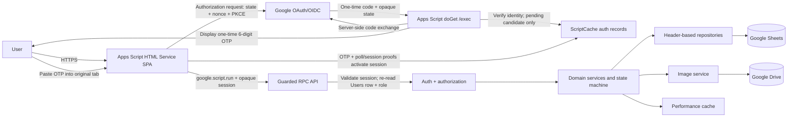

# CRS Yuem-Kuen System Architecture

## Goals

ระบบเป็น internal web application สำหรับองค์กรขนาดเล็กถึงกลาง รองรับประมาณ 1,000–5,000 physical assets โดยใช้ Google Workspace ที่มีอยู่แล้ว ลดภาระการติดตั้งและดูแลโครงสร้างพื้นฐาน และรักษา workflow ให้ย้ายฐานข้อมูลในอนาคตได้

## Context and layers

### Client

`index.html` เป็น shell เดียวและ include เฉพาะ partial ใน allowlist ตอน render เพื่อหลีกเลี่ยงข้อจำกัดหลายหน้าของ Apps Script หน้าเว็บแยก view templates ออกจาก controllers, จัด route ด้วย `google.script.history`/`google.script.url`, และใช้ view token ป้องกัน response เก่าเขียนทับหน้าใหม่

การลงชื่อเข้าใช้เปิด Google Authorization endpoint ใน popup ที่เกิดจาก user gesture โดยไม่โหลด GIS JavaScript ใน HTML-service iframe Browser สร้าง poll secret และ candidate application-session secret ด้วย Web Crypto, ส่งเฉพาะ hash ไปเริ่ม flow แล้วเก็บค่าจริงไว้ในหน่วยความจำ เมื่อ callback สำเร็จ browser poll ผลผ่าน `google.script.run`; authorization code อยู่เฉพาะ callback มาตรฐานและไม่มี ID/access/application-session token ใน URL

ทุก business call ผ่าน Promise wrapper ของ `google.script.run`, แนบ opaque application session อายุไม่เกิน 6 ชั่วโมง และแปล envelope/error เป็น client error แบบเดียว ค่าเริ่มต้นเก็บ session ใน `sessionStorage`; เมื่อผู้ใช้เลือก “จดจำการเข้าสู่ระบบ” จึงเก็บใน `localStorage` พร้อม expiry และ sync logout ข้ามแท็บ ไม่ใช้ cookie และไม่เก็บ Google token/email/role หากหมดอายุ, cache ถูก evict หรือ backend ปฏิเสธ client จะล้าง token และแสดงหน้า login โดยไม่เปิด popup เอง ส่วน mutation สร้าง command ID ก่อนส่งและเก็บใน `sessionStorage` พร้อม fingerprint ของ payload เพื่อให้ retry หลังผลลัพธ์ไม่แน่ชัดใช้คำสั่งเดิมเท่านั้น

QR controller สร้างสัญลักษณ์และสติกเกอร์ PNG ใน browser จาก canonical asset URL โดยใช้ vendored `qrcode-generator` และอ่าน QR จากไฟล์/ภาพที่ผู้ใช้เลือกด้วย vendored `html5-qrcode` เท่านั้น รูปไม่ออกจาก browser และ decoded payload ต้องผ่าน exact HTTPS application path, route, query และ Asset ID allowlist ก่อนเรียก SPA navigation. HTML Service จำกัด `getUserMedia()` จึงไม่เปิด live camera stream; mobile ใช้ native camera/file picker ผ่าน input `capture="environment"` และยังมี Asset ID manual fallback.

### API and authorization

Auth bootstrap เปิดเฉพาะ `beginOAuthSignIn`, `completeOAuthSignIn` และ `logoutSession`; endpoint เหล่านี้ไม่คืน business data และใช้ secret/flow แบบเดาผ่านไม่ได้ ส่วน callback เป็น private implementation ที่ doGet เรียกหลังแยก callback request การเริ่ม flow ใช้ CSRF state ที่ server สร้างด้วย HMAC-SHA256 keyed PRF, OIDC nonce, PKCE S256 และ one-time cache record Callback แลก code กับ Google ผ่าน server-side POST โดยใช้ Web OAuth Client secret จาก Script Properties แล้วตรวจ ID token ด้วย Google JWKS ครบทั้ง RS256, `iss`, `aud`/`azp`, `iat`/`nbf`/`exp`, nonce, `sub`, `email_verified` และ authoritative-email rule ก่อนตรวจ exact Users row, `ACTIVE` และ role

API ธุรกิจเปิดเฉพาะ use-case ที่ชัดเจน เช่น `listEquipment`, `createBorrowRequest`, `adminApproveBorrow` และ `adminCompleteReturn` ไม่เปิด generic Sheet CRUD ทุก public wrapper รับ application session เป็น argument แรก Session record อยู่ใน `ScriptCache` ภายใต้ hash ของ secret, ผูกกับ verified `sub`/email/User ID/OAuth client และ temporary active-user key ของ Apps Script มี absolute TTL จาก `AUTH_SESSION_TTL_SECONDS` (ค่าเริ่มต้น 21,600 วินาที) หลังตรวจ ID token สำเร็จ ทุก call ตรวจ session/domain แล้ว re-read Users row ปัจจุบัน; ไม่มี/invalid/expired/evicted session, unknown/inactive user หรือสิทธิ์ไม่พอถูกปฏิเสธก่อน handler และทุก mutation re-read Users row ภายใน lock เพื่อปิด privilege escalation `CacheService` อาจ evict ก่อน TTL ได้ ซึ่งมีผลเพียงให้ session fail closed และต้องลงชื่อเข้าใช้ใหม่

### Domain services

บริการ Equipment, Borrow, User, Category, Dashboard, Image และ History เป็นเจ้าของ business rules โดยเฉพาะ BorrowService เป็นผู้เดียวที่เปลี่ยนสถานะ workflow ของ Equipment ระหว่าง Pending/Reserved/Borrowed/Returning ส่วน OperationService เป็น durable coordinator สำหรับ idempotency และ recovery ของ mutation ข้ามหลายชีต/Google Drive โดยไม่อ้างว่า Sheets มี transaction

### Repositories

repository อ่าน header และ `getValues()` ครั้งเดียวต่อชุดข้อมูล แปลง row เป็น plain object และ batch write กลับด้วย `setValues()` จึงไม่ผูก domain logic กับเลขแถวหรือ Spreadsheet API โดยตรง

### Verification layers

ชุดทดสอบ local แบ่งเป็นสามชั้น: source/security contracts compile ไฟล์ Apps Script และ browser ทั้งหมดพร้อมตรวจ public surface, routes/includes, ID/QR contracts; backend tests รัน domain services จริงกับ in-memory Apps Script service doubles; Playwright ประกอบ HTML includes จริงและจำลอง `google.script.run` เพื่อทดสอบ navigation, feedback, QR UI และ responsive layout โดยไม่ต้อง deploy. Google Workspace identity, authorization, Sheets/Drive จริง, HTML-service sandbox และ native mobile capture เป็น deployment acceptance แยกต่างหาก เพราะ local doubles ไม่ควรถูกใช้เป็นหลักฐานแทนบริการจริง

## Mutation protocol

ทุก mutation สำคัญใช้ลำดับเดียวกัน:

1. ตรวจรูปแบบ payload ที่ไม่ต้องอ่านฐานข้อมูล
2. ขอ Script Lock พร้อม timeout
3. resolve actor และ role ใหม่ภายใน lock
4. อ่านข้อมูลจริงจาก Sheet โดยไม่ใช้ cache และสร้าง operation specification จาก action, entity/asset, actor และ hash ของ normalized payload
5. ถ้า operation เดิมเป็น `COMPLETED` และ specification ตรงกัน ให้ verify result hash แล้วคืน stored result โดยไม่ทำ domain mutation ซ้ำ
6. ถ้าเป็นคำสั่งใหม่ ให้ตรวจ source state, row version, foreign key และห้ามมี `STARTED` operation อื่นที่ชน entity, asset หรือ normalized unique reservation ก่อนเขียน Operations row สถานะ `STARTED` พร้อม payload/hash และ before-state
7. จัดสรร ID/ผูก entity หรือ external resource เมื่อจำเป็น แล้วเขียนหรือเติมเฉพาะ domain rows ที่ยังอยู่ source state; ถ้าแถวอยู่ exact target state แล้วให้ถือว่า step นั้นสำเร็จจากรอบก่อน
8. รับรองว่ามี History ตรงกับ `operation_id` เพียงหนึ่งแถว จากนั้น bump cache epoch และ `SpreadsheetApp.flush()` เพื่อยืนยัน domain rows กับ audit ก่อน finalize
9. serialize result กับ result hash ลง Operations, เปลี่ยนสถานะเป็น `COMPLETED`, flush อีกครั้งเมื่อออกจาก critical section แล้วปล่อย lock ใน `finally`

Google Sheets ไม่มี rollback/cross-sheet transaction จริง ลำดับ `STARTED → domain rows → exactly-one History → flush → result/COMPLETED` จึงทำให้ความคืบหน้าทนต่อ execution ที่หยุดกลางทาง โดย Borrow ยังเป็นหลักฐาน active workflow และ Equipment เป็น projection สำหรับงานปฏิบัติการ

### Retry and reconciliation

- Retry ต้องใช้ command ID, action และ normalized payload เดิม; action/entity/asset/hash ที่ไม่ตรงจะถูกปฏิเสธด้วย conflict และ actor ต้องเป็นเจ้าของเดิม เว้นแต่ admin ทำ controlled reconciliation
- `COMPLETED` verify hash แล้วคืน stored result เดิม ส่วน `STARTED` verify payload hash, โหลด payload/before-state เดิม และทำต่อเฉพาะ step ที่ขาด
- การ resume ยอมรับ domain row เฉพาะ exact source หรือ exact target state/row version ที่ operation บันทึกไว้ ถ้ามีการแก้ไขต่อจากนั้นจะ fail closed แทนการเดาผลลัพธ์
- `STARTED` ของ entity หรือ asset เดียวกันบล็อก command ID อื่นด้วย `OPERATION_PENDING`; asset guard ครอบคลุมคำขอยืมที่ยังไม่มี Borrow ID และ workflow ที่แตะ Equipment เดียวกัน
- `STARTED` ยังจอง normalized serial number, user email และ category name สำหรับ create/edit ที่เกี่ยวข้อง ปิดช่องให้ command คนละ entity ผ่าน uniqueness preflight พร้อมกันแล้วมาชนกันภายหลัง
- Image operation เก็บ `resource_id` เพื่อไม่สร้างไฟล์ซ้ำและให้ cleanup เฉพาะไฟล์ใหม่ที่ operation นั้นสร้าง
- ถ้า image upload หยุดก่อนเปลี่ยน Equipment และไม่สามารถ resume ได้ Admin ยกเลิกแบบมีเหตุผลได้; ระบบพิสูจน์ exact before-state, ห้ามมี History, ย้าย partial Drive file ที่เข้าถึงได้ไป Trash แล้วบันทึกผล hash พร้อมสถานะ `ABORTED` หากโฟลเดอร์เดิมเข้าไม่ได้จะระบุ orphan-cleanup warning ไว้ในผลลัพธ์
- Integrity audit รายงาน journal ที่ค้างและความไม่สอดคล้อง ผู้ดูแลควร replay คำสั่งเดิมเพื่อ reconcile; กรณี state ไม่ใช่ source/target ที่คาดไว้ต้องใช้การซ่อมแบบตรวจสอบได้ ไม่แก้ Operations/History โดยตรง

## Performance

- Equipment search/filter/sort/pagination ทำบน server และจำกัด page size สูงสุด 100
- อ่านแต่ละ Sheet เป็น block ไม่อ่านทีละ cell
- reference lists และ dashboard อาจ cache ระยะสั้นโดยมี cache epoch หลัง mutation
- availability, role, counter และ active borrow ไม่ใช้ cache ตัดสินความถูกต้อง
- DTO คืนเฉพาะข้อมูลที่หน้าปัจจุบันต้องใช้ และแปลง Date เป็น string เสมอ

## Security boundaries

- Deployment เปิดเฉพาะ Google Account ที่ลงชื่อเข้าใช้ (`ANYONE`) แต่ application allowlist ใช้ `ALLOWED_DOMAINS`; `ALLOWED_DOMAIN` เป็น legacy fallback เฉพาะเมื่อยังไม่มี `ALLOWED_DOMAINS` และไม่รวม subdomain/alias โดยอัตโนมัติ
- ผู้ใช้แอปทั่วไปไม่มี direct role ต่อ Sheet/Drive folder; เฉพาะผู้ deploy และผู้ดูแลที่อนุมัติเท่านั้นที่เข้าถึง datastore/project โดยตรง Manifest pin Drive, Sheets, deployer-email และ `script.external_request` สำหรับดึง Google JWKS
- Authorization code แลก token เฉพาะฝั่ง server; Google ID token ไม่ออกจาก callback backend และต้องตรวจ signature/claims/nonce ครบก่อนสร้าง session มันไม่ใช่ authorization โดยตัวเอง และ server ไม่รับ email, role, audit actor, timestamp หรือ protected status จาก browser เป็นความจริง
- บัญชี `@gmail.com` ต้องมี `email_verified=true`; Google Workspace/non-Gmail ต้องมี `email_verified=true` และ `hd` ตรง exact email domain ที่ allowlist ระบบไม่ยอมรับ Google Account ที่ใช้อีเมล third-party และไม่มี authoritative `hd`
- Users row เป็น explicit application allowlist: ไม่มีการ auto-provision, unknown/inactive ถูกปฏิเสธ และ Admin endpoint ตรวจ role จาก row ปัจจุบันทุกครั้ง
- Opaque state/nonce/PKCE และ auth/session record ใช้ครั้งเดียวหรือมีอายุสั้น; raw application session อยู่ใน page memory เท่านั้น และ auth state/session ไม่ใช้ `UserProperties` เพราะ `USER_DEPLOYING` อาจทำให้ผู้ใช้ทั้งหมดเห็น context เจ้าของเดียวกัน
- `Session.getTemporaryActiveUserKey()` ใช้เป็น secondary context binding เท่านั้น ไม่ใช่ visitor identity; verified Google token และ Users row ยังเป็น identity/authorization source ที่แท้จริง Callback ไม่ตรวจ temporary key และต้องใช้รหัสยืนยันจากหน้า callback ร่วมกับ poll/session proof ก่อนเปิด session จึงต้อง pilot แยก browser profile กับ Workspace/Gmail ก่อนเปิด production
- user อ่าน Borrow ของตนเองเท่านั้น; admin อ่านและ mutate ข้อมูลส่วนกลางตาม action ที่อนุญาต
- ข้อมูล text ถูกจำกัดความยาว ป้องกัน formula injection ก่อนลง Sheet และ escape ก่อนเข้า HTML
- QR มีไว้ระบุ Asset ID/route เท่านั้น ไม่ให้สิทธิ์และไม่ trigger mutation อัตโนมัติ
- server รับ QR base เฉพาะ canonical `script.google.com/macros/s/.../exec` ที่ตรงกับ deployment ปัจจุบัน; `/dev`, host/path อื่น และ deployment ที่ไม่ตรง fail closed
- QR scanner ไม่ตาม decoded URL โดยตรงและไม่ render payload เป็น HTML; external origins, duplicate/conflicting IDs และ query ที่ไม่รู้จักถูกปฏิเสธ
- History ไม่มี update/delete endpoint และ reference records ใช้ inactive/retired แทน delete
- Operations และ payload/before/result evidence ไม่มี generic browser endpoint; client ได้รับเฉพาะผลลัพธ์ use-case ที่ผ่าน authorization
- รูปใน Drive รองรับเฉพาะ `DOMAIN_WITH_LINK` หรือ `ANYONE_WITH_LINK`, ตรวจ effective sharing หลังตั้งค่า และเก็บ resource key ใน URL เมื่อ Drive กำหนด; ไม่มีโหมด `PRIVATE` ที่อ้างว่า browser ของผู้ใช้คนอื่นเปิดรูปได้โดยไม่มี delivery proxy
- `DOMAIN_WITH_LINK` เป็น authorization boundary ระดับ Workspace domain ไม่ใช่ Users row และไม่รองรับ Gmail ภายนอก; ผู้ใช้ Gmail ที่ผ่าน application auth อาจยังเปิดรูปไม่ได้ ขณะที่ same-domain link holder อาจดูรูปได้แม้เข้าแอปไม่ได้
- `ANYONE_WITH_LINK` ทำให้ Workspace/Gmail เปิดภาพได้ แต่ทุกคนที่มี URL อาจอ่านภาพโดยไม่ผ่าน token หรือ Users row จึงใช้ได้เฉพาะภาพครุภัณฑ์ที่จัดชั้นเป็นสาธารณะตามลิงก์และผ่านการอนุมัติความเสี่ยง การเปลี่ยน policy ไม่ย้อนสิทธิ์ไฟล์เก่า

## Deployment topology

โปรเจกต์ Apps Script แบบ standalone เชื่อม Google Sheet, Drive folder และ Web OAuth Client ID/secret ด้วย Script Properties Production ใช้ versioned Web app แบบ `USER_DEPLOYING` + `ANYONE` ซึ่งหมายถึง Google Account ที่ลงชื่อเข้าใช้แล้ว ไม่ใช่ `ANYONE_ANONYMOUS`; backend จึงใช้สิทธิ์ผู้ deploy โดยผู้ใช้ทั่วไปไม่มี direct access ต่อ Sheet/folder แต่ identity มาจาก ID token ที่ server แลกและตรวจเอง

OAuth Client ต้องเป็นชนิด **Web application** และลงทะเบียน Authorized redirect URI แบบ exact เป็น `https://script.google.com/macros/s/{PILOT_DEPLOYMENT_ID}/exec`; flow นี้ไม่ใช้ Authorized JavaScript Origin และไม่โหลด GIS JavaScript จาก iframe การแก้ deployment เดิมให้ชี้ version ใหม่จะรักษา `/exec` URL และ QR sticker เดิม แต่ต้องทำ deployment ชั่วคราวเพื่อ pilot callback/temporary-user-key binding กับทั้ง Workspace และ Gmail ก่อนเปลี่ยน production รายละเอียดอยู่ใน [DEPLOYMENT.md](DEPLOYMENT.md)

## Pilot callback confirmation update

Visitor OAuth returns to the exact Pilot `/exec` URL configured in `GOOGLE_OAUTH_REDIRECT_URI` (Script Properties) and the OAuth Web application's Authorized redirect URIs. Do not use `/usercallback`, StateTokenBuilder, wildcard origins, or the production URL. `doGet` routes any code/error/state request to a private callback implementation; malformed/duplicate/replayed/expired state fails closed.

Callback verifies Google identity but only stores a pending candidate, NOT an active session. It displays a six-digit numeric OTP generated from a server-keyed HMAC CSPRNG. The server stores only a flow-bound OTP HMAC, never the plaintext code; the OTP expires after five minutes, permits at most five failed submissions, is consumed immediately on success, and cannot be replayed. Confirmation still requires the OTP plus the original browser-held poll AND session proofs. Users/ACTIVE/Role are checked again at activation and on every business RPC. Never share an OTP or complete a sign-in flow started by someone else.

The callback does NOT read or compare `getTemporaryActiveUserKey()`. Its context may differ from the original RPC context. The existing temporary-key check remains only between begin/complete/business RPCs as additional defense; it is not relied on to stop attacker-started/victim-redeemed callbacks. No Google/session token appears in URLs. Raw callback state is hashed in cache; nonce/PKCE verifier are transient server-only cache data. Random server values use a domain-separated HMAC-SHA256 PRF keyed by the confidential OAuth client secret with UUID/time uniqueness input; protect/rotate that secret and never log it.

Deployment procedure: pass all tests, commit and push `main`, verify `USER_DEPLOYING` + `ANYONE`, upload, create an immutable version, download/compare the new immutable version, then update ONLY the existing Pilot deployment. No separate pre-deploy backup is created. Production promotion requires real YRU/Gmail login, confirmation, session isolation, and authorization acceptance.
